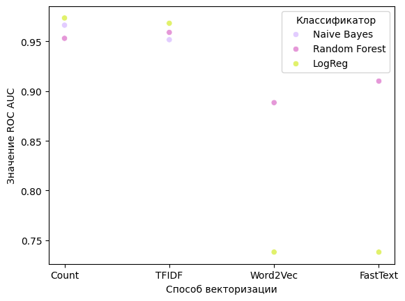

# Тестовое задание вк на классификацию спама

- [код решения](spam_detection.ipynb)
- [предсказания на тестовой выборке](scoring.csv)
- [лемматизированные данные, разбитые на train, val и test](/clean%20data)

Максимальный auc_roc на валидации: __0.97__ 

Лучший результат был получен при векторизации лемматизированных текстов CountVectorizer и классификации LogisticRegression, другие комбинации способов векторизации и кластеризации на графике: 

